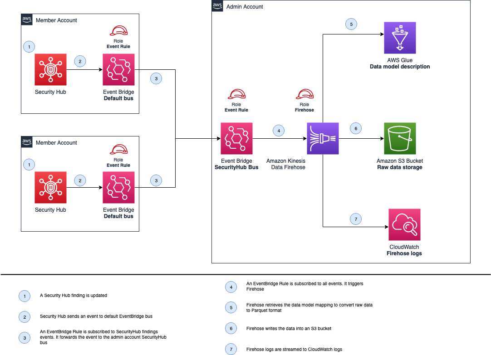

# aws-security-hub-glue-aggregator

Code to deploy a solution to aggregate the findings from Security Hub from different accounts to a centralized account using Amazon Kinesis Data Firehose and AWS Glue

## Table of Contents

- [Description](#description)
- [Prerequisites](#prerequisites)
- [Dependencies](#dependencies)
- [Variables](#variables)
- [Usage](#usage)
- [Security](#security)
- [License](#license)


## Description

### Admin account module
This Terraform module creates an Amazon Kineses Data Firehose ready to receive Security Hub findings from Event Bridge.
After Amazon Firehose will use AWS Glue to get the data model mapping for the Security Hub findings then writes the data to an S3 Bucket in Parquet format. The module includes all needed roles for the proper access of the services.

### Member account module

This Terraform module creates an Event Bridge rule that captures the Security Hub findings and forwards it to the Event Bridge in the Admin module.

### Architecture
The following diagram describes the full architecture.



1. A Security Hub finding is updated/modified
2. Security Hub sends an event to the default EventBridge bus in the member account
3. The EventBridge rule is subscribed to capture those findings and forward them to the dedicated EventBridge bus in the admin account
4. The EventBridge rule is subscribed to capture any event in the dedicated bus and it will consequently trigger Amazon Firehose
5. Firehose retrieves the data model mapping from AWS Glue to convert the raw data into Parquet format
6. Firehose writes the data into the S3 Bucket


> Pay attention:
Both modules are meant to be used as standalone modules. They have to be deployed independetly to the relevant AWS accounts

## Prerequisites
 
* **AWS Security Hub**: 
This module expects that [AWS Security Hub](https://aws.amazon.com/security-hub/) is already up and running in the region where the EventBridge rule will be deployed.
The setup can be easily carried out by following the official [documentation](https://docs.aws.amazon.com/securityhub/latest/userguide/securityhub-settingup.html).

## Dependencies

* **terraform**: 1.2.7 [Reference](https://github.com/hashicorp/terraform)

## Variables

The available variables are described in [variables.tf](./variables.tf) file for each module.

## Usage

### Backend Configurations
In case you would like to run the module as a standalone, you will need to initialize the creation of an S3 bucket and a DynamoDB table to track the terraform states.

```bash
cd tf-state
terraform init && terraform apply
cd ..
terraform init -backend-config=config/backend.conf
```

### Deployment
**Option 1:**
You can use the following samples to utilize the modules within your code:

```
module "reporting-admin-standalone" {
  source                        = "./modules/reporting-admin-module"
  name_prefix                   = local.name_prefix
  custom_tags                   = local.tags
  firehose_logs_retention_days  = "1"
  allowed_member_accounts       = ["11111111","22222222"] //Add member accounts here
}
```

```
module "reporting-member-standalone" {
  source = "./modules/reporting-member-single-module"

  name_prefix          = local.name_prefix
  admin_events_bus_arn = <<ADD_HERE_THE_ARN_FOR_ADMIN_EVENT_BUS>>
}
```

Please have a look inside inside [variables.tf](./variables.tf) for all the possible options.

**Option 2:**
Alternatively, if you have [Terraform](https://www.terraform.io/) installed on your workstation, you can deploy the example by executing:

```bash
export AWS_PROFILE=<profile>
export AWS_DEFAULT_REGION=eu-west-1

terraform plan -target=module.reporting-admin-module -var region=$AWS_DEFAULT_REGION -var profile=$AWS_PROFILE
terraform apply -target=module.reporting-admin-module -var region=$AWS_DEFAULT_REGION -var profile=$AWS_PROFILE

terraform plan -target=module.reporting-member-module -var region=$AWS_DEFAULT_REGION -var profile=$AWS_PROFILE
terraform apply -target=module.reporting-member-module -var region=$AWS_DEFAULT_REGION -var profile=$AWS_PROFILE
```

> Pay attention:
you should first modify the `AWS_DEFAULT_REGION` in accordance to your requirements.

### Testing

Using the following script will attempt to test the process by using fake findings:

```bash
source ./modules/reporting-admin-module/sh_test_event.cli

```

### Cleanup

Use with caution:

```bash
terraform destroy -var region=$AWS_DEFAULT_REGION -var profile=$AWS_PROFILE
```

## Security

See [CONTRIBUTING](CONTRIBUTING.md) for more information.

## License

This project is licensed under the Apache-2.0 License.

=======
